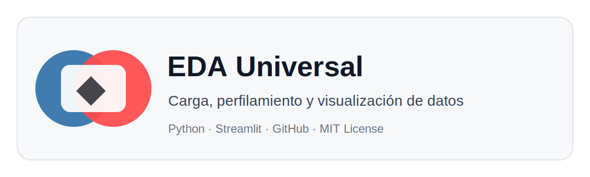

# EDA Universal con Streamlit




## Objetivo

Crear una aplicación de **análisis exploratorio de datos** que funcione con distintos datasets en formato CSV o Excel.

La app permite revisar:

- Tamaño del dataset.
- Tipos de datos.
- Valores nulos.
- Duplicados.
- Estadística descriptiva.
- Variables numéricas, categóricas y fechas.
- Visualizaciones iniciales.
- Exportación de reportes.

## Estructura del proyecto

```text
02_eda_universal_streamlit/
├── app.py
├── requirements.txt
├── README.md
├── LICENSE
├── .gitignore
├── .streamlit/
│   └── config.toml
├── assets/
│   └── banner.svg
└── data/
    └── dataset_demo.csv
```

## Ejecutar localmente

```bash
python -m venv .venv
.venv\Scripts\activate
pip install -r requirements.txt
streamlit run app.py
```

En Mac/Linux:

```bash
python3 -m venv .venv
source .venv/bin/activate
pip install -r requirements.txt
streamlit run app.py
```

## Uso de la aplicación

1. Sube un archivo `.csv`, `.xlsx` o `.xls`.
2. Revisa la pestaña de resumen.
3. Analiza valores nulos y duplicados.
4. Revisa estadísticas y tipos de variables.
5. Genera visualizaciones.
6. Descarga los reportes generados.

## Reto de mejora

Agregar una sección de limpieza con estas opciones:

- Eliminar duplicados.
- Reemplazar nulos con media, mediana o moda.
- Cambiar nombres de columnas.
- Descargar dataset limpio.

## Licencia

MIT. El estudiante puede reutilizar y modificar el proyecto dando el crédito correspondiente.
